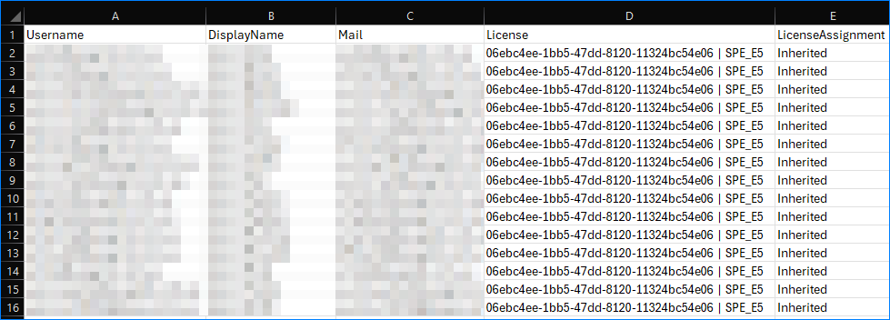
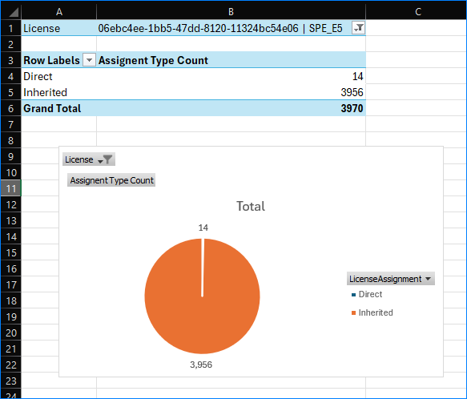

# M365 User License Assignment Type by Sku

Get Microsoft 365 users license assignment type by Sku

## Requirements

- [Microsoft Graph SDK - PowerShell Module](https://learn.microsoft.com/en-us/powershell/microsoftgraph/installation?view=graph-powershell-1.0)

## Usage Instructions

This script requires connection to Microsoft Graph PowerShell with these minimum permissions: LicenseAssignment.Read.All, User.ReadBasic.All

```PowerShell
Connect-MgGraph -TenantId org_name.onmicrosoft.com -Scopes LicenseAssignment.Read.All, User.ReadBasic.All
```

You must also know the SKU name of the license you want to query. For example, **Microsoft 365 E5** is **SPE_E5**.

Refer to [Product names and service plan identifiers for licensing.](https://learn.microsoft.com/en-us/entra/identity/users/licensing-service-plan-reference)

### Example 1 - Get all users with Microsoft 365 E5 license assigned

```PowerShell
$result = .\Get-UserLicenseAssignmentBySku.ps1 -SkuPartNumber SPE_E5
```


### Example 2 - Get all users with Microsoft 365 E5 license assigned and export to CSV

```PowerShell
$result = .\Get-UserLicenseAssignmentBySku.ps1 -SkuPartNumber SPE_E5
$result | Export-Csv .\result.csv -NoTypeInformation
```




